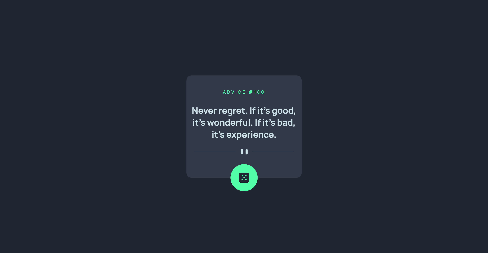
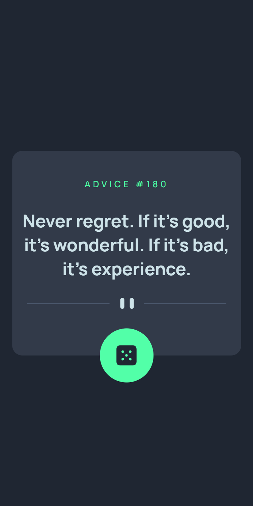

# Frontend Mentor - Advice generator app solution

This is a solution to the [Advice generator app challenge on Frontend Mentor](https://www.frontendmentor.io/challenges/advice-generator-app-QdUG-13db). Frontend Mentor challenges help you improve your coding skills by building realistic projects.

## The challenge

The challenge is to build out this advice generator app using the [Advice Slip API](https://api.adviceslip.com) and get it looking as close to the design as possible.

## Table of contents

## Overview

### Screenshot

Desktop View

Mobile View

### Links

- Solution URL: [Solution](https://www.frontendmentor.io/solutions/faq-accordion-card-ZRNKpuudS)
- Live Site URL: [Live Site](https://sansarj17.github.io/FM-AdviceGenerator/)

### Built with

- Advice Slip API
- CSS Flexbox
- CSS custom properties
- Modern JS(ES6) fetch API

## Author

- Github - [@sansarj17](https://github.com/sansarj17/)
- Frontend Mentor - [@sansarj17](https://www.frontendmentor.io/profile/sansarj17)
